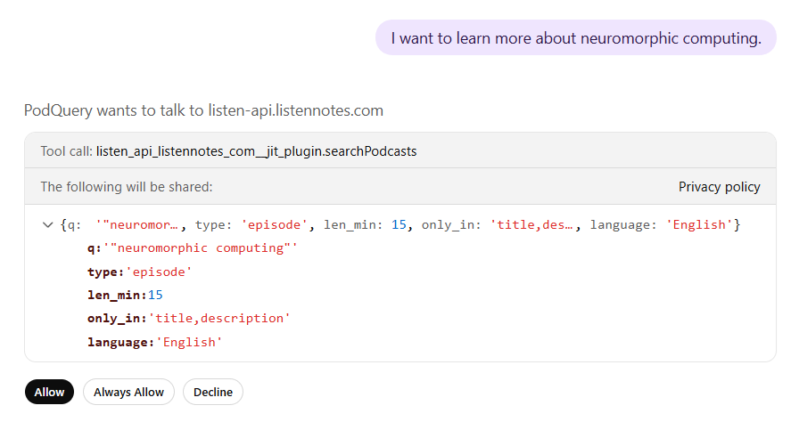
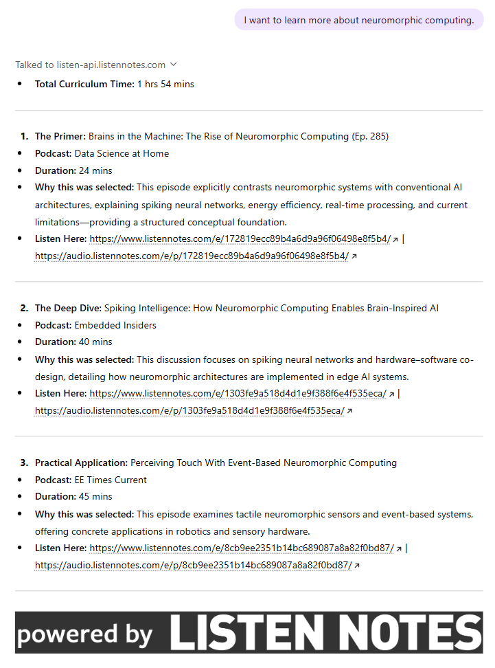
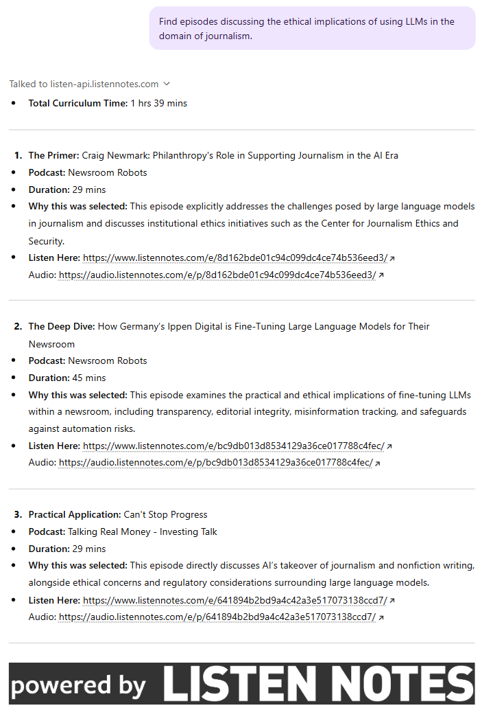
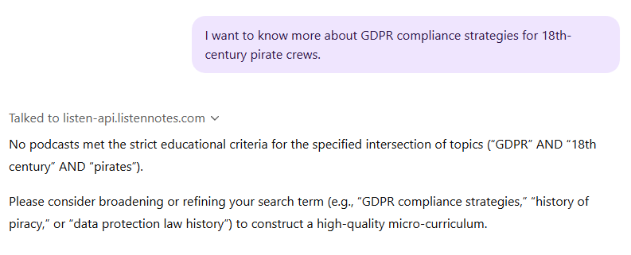

# PodQuery GPT

### What it does
Podcasts are a good medium for passive learning, especially during dead times such as driving or commuting. However, I noticed that finding a high-quality episode on a niche technical topic often requires manually sifting through many irrelevant content or "fluff."

So I made a custom GPT to automate this discovery process. It transforms a user intent (e.g., "I want to learn about X") into a micro-curriculum of specific podcast episodes. It is made to filter out casual banter and surface only the most informative episodes, hopefully saving a good chunk of research time.

### How does it works
- Before calling the API, it converts the user's natural language prompt into exact phrase matches to formulate a query suitable for Listen Notes.
- Executes a GET /search request to the Listen Notes API (with a few [constraints](#searching-constraints)).
- Parses the JSON payload to analyse the resulting episode descriptions and filters them to select the three highest-signal episodes.
- It arranges them into a structured order, justifying their selection and providing links for listening.

## Table of Contents

- [Project Tree]()
- [A]()

## Setup Guide
### 1. Obtain your Listen Notes API Key
Go to the [Listen Notes API Page](https://www.listennotes.com/api/) and subscribe to the free plan. You will get 50 requests per month (the landing page says 300, but you'll see it is actually 50), which I think is more than enough for this tool.

Listen Notes will ask you to provide context about how and for which platforms you're going to use their service. They do it primarily to prevent scraping. You can copy and paste these descriptions:

- **Use case**: _I am developing an AI-powered educational curation agent built as an OpenAI Custom GPT. The tool utilizes the /search endpoint to transform natural language prompts into structured "Micro-Curricula." It fetches raw JSON metadata, applies LLM reasoning to filter for educational value, and returns a ranked list of episodes. The GPT operates statelessly within OpenAI's infrastructure. It does not pre-fetch, cache, index, or store any data on a back-end server._
- **Platforms**: _The application is accessible via the Web, iOS, and Android. As an OpenAI Custom GPT, it is not a standalone downloadable app but operates entirely within the official OpenAI ecosystem. It is accessible to users simultaneously through the ChatGPT web interface and the official ChatGPT mobile applications for iOS and Android._

Within minutes you should receive a confirmation email and be able to navigate to your [Listen Notes API Dashboard](https://www.listennotes.com/api/dashboard/) where you can copy your API Key (make sure you keep it secure, do not share or publish it anywhere).

#### Why Listen Notes and not Spotify?
Primarily:

- Spotify’s API does not support duration filtering in the search query; you would have to fetch irrelevant 2-minute trailers and filter them out afterwards, wasting tokens and processing power.
- Similarly, you can instruct Listen Notes to search only the title and description, ignoring authors and audio transcripts. Spotify searches all metadata fields simultaneously which would flood results with irrelevant hits.
- Listen Notes indexes the entire open podcast ecosystem (RSS feeds from everywhere, including Apple Podcasts), Spotify is more of a closed garden that (understandably) prioritises its own content.

### 2. Initialise the custom GPT
- Create a new GPT using the _Configure_ tab.
- Disable _Web Search, Canvas, Image Generation_ and _Code Interpreter & Data Analysis_: leaving these enabled can cause the model to get "distracted" and, for instance, attempt web searches instead of strictly using your API.
- I recommend selecting _GPT-5.2 Instant_ as the default model: this tool does not require deep problem-solving capabilities; it simply needs adherence to a YAML schema. We also don't want a 10 to 30-seconds delay or the model to second-guess our instructions.

### 3. Define the instructions
Paste [this](./configuration/instructions.txt) block of text into the _Instructions_ field.

#### Brief explanation on the instructions I gave

Formulating the query

<blockquote>
  
  When designing the instructions to convert the raw user prompt into a keyword-based query, I noticed a "precision vs recall" trade-off.
  
  - If a user provides verbose, natural-language descriptions with lists of synonyms or related concepts, the API search failed. E.g., to the prompt: _"I want to learn more about the world of AI, machine learning and deep learning"_, the GPT would try to find episodes containing every single one of those terms in the title/description. This resulted in too few search results.
  - Conversely, I found that if the GPT summarized too much, it stripped away the specific topics the user actually cared about. E.g., if a user asks: _"Give me episodes on servant leadership for founders in early-stage startups"_, an over-simplifying agent quried just for _"servant leadership"_, returning generic, corporate-leaning advice.
  
  I tuned this instruction set so as to strike a balance between these aspects.

<blockquote>

Searching (constraints)

<blockquote>
  
  I implemented some constraints to filter out low-value content directly during its retrieval.

  - `type`: "episode" - Searching for "podcasts" (shows) is too broad; I wanted self-contained "lessons" on a topic, not a subscription to an entire series.
  - `len_min`: 15 - Otherwise many results would be 5-minute trailers or news bites. A 15-minute floor ensures enough depth to provide educational value.
  - `only_in`: "title,description" - Reduces false positives by excluding full transcripts from the search (a keyword might be mentioned during a 1-hour conversation without being the actual focus of the episode.)
  
<blockquote>

Why returning only three episodes?

<blockquote>
  
  - If an AI returns a list of ten links, it is merely a search engine forcing the user to do additional curation work themselves.
  - I wanted to prevent decision fatigue by restricting the output to just a few episodes.

<blockquote>

Running time calculation

<blockquote>
  
  - A user's decision to listen is often dictated by their available time, so I wanted to show durations upfront.
  - Without the code interpreter enabled, LLMs often attempt to "reason" simple arithmetic based on likelihood rather than logic. Since this led to hallucinations and rounding errors, I assigned a strict order of operations that forces the model to act like a deterministic algorithm.

<blockquote>

Mandatory attribution

<blockquote>
  
  I put this since in the Listen Notes API documentation, it is mentioned how any application that displays data fetched from the Listen API must show the "Powered by Listen Notes" logo on the screen.

<blockquote>

### 4. Configure the searchPodcasts action
- At the bottom of the _Configure_ tab, click _Create new action_.
- In the _Schema_ box, paste the following [YAML OpenAPI specification](#./configuration/openapi_schema.yaml). This tells the GPT exactly how to format the search request to Listen Notes.
- In the _Authentication_ field, select _API Key_ as _Authentication Type_ and paste your [Listen Notes API Key](#1.-obtain-your-listen-notes-api-key) below.
- As _Auth Type_ select _Custom_ and paste `X-ListenAPI-Key` in the _Custom Header Name_ field.
- If asked for a _Privacy policy_ paste `https://www.listennotes.com/privacy/`, even if for private GPTs, this is usually not required.

### 5. Save
- Click _Create_ and select _Only me_.

## Usage and Examples
Upon your first request, the GPT will ask for permission to connect to `listen-api.listennotes.com`. Here you can review the query that will be utilised for your search.

Click _Allow_ (or _Always Allow_ if you don't want to see this at every request). At this point, the three episodes will be returned, together with two links:

- The first one redirects you to the Listen Notes episode page (where the specific Spotify, Apple Podcasts, or other links can be found).
- The other allows you to listen or download the episode directly from your browser.

---

You can also search for specific topics at the intersection of more domains.  

---

Finally, if no episodes meet the criteria, the GPT explicitly reports that no results have been found rather than fabricating data or suggesting irrelevant content.

